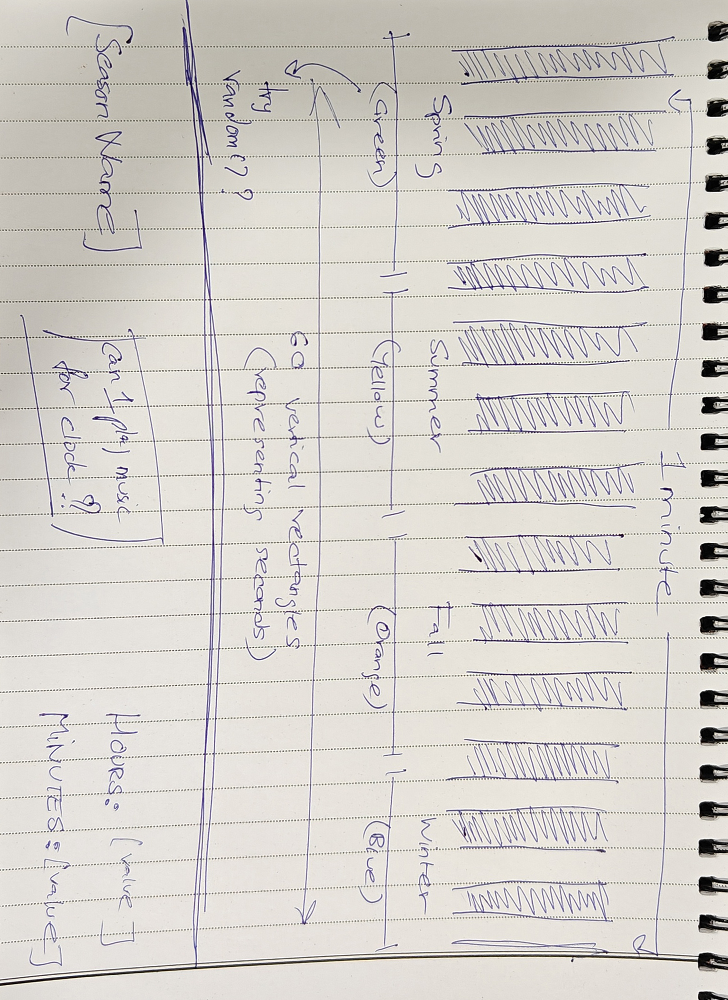

# ReadMe - HW04A Working Document

🎶 On the site, click your mouse anywhere to get the best experience 🎶

This assignment has been the most interesting one that I've done so far, and has allowed me to express myself creatively, and I feel that I've been able to reproduce what I had in mind for this one.

This exercise had us representing time using p5, and utilizing rather abstract concepts. The requirements for this exercise was to depict 3 sub-divisions of time. In my rendition, I've chosen to depict 4 sub-divisions:

1. ***Seconds*** (visual)  
2. ***Minutes*** (textual)  
3. ***Hours*** (textual)  
4. ***Seasons*** (visual & textual)  

This took a little time to visualize, but quite a lot of time to execute because I kept getting confused while coding the time increments. The basic logic is that every vertical line represents a ***second***. The lines start appearing every second, and cover the entire viewport in a ***minute***. The minute counter gets incremented by 1 whenever the whole page fills up. Similarly, for counting the ***hours***, the minutes counter value is divided by 60 to give the value in hours. I've made use of the ***modulo operator (%)*** to count the hours.

For the ***seasons***, I've taken a little creative liberty. Instead of waiting for a quarter of an year and then showing the change, I've sped the entire process up. Visually, I've divided the screen into 4 equal parts, each representing one season respectively. As the seconds' pattern cover the screen real-estate, the seasons change accordingly. This is visually represented with a color change, and at the bottom, the season name changes accordingly as well.

I had made a simple sketch to visualize my creation physically, before I commenced coding it:

Before drawing this out, I actually had a different idea which I scrapped 'coz I wasn't getting that excitement out of it. It involved playing around with circles, and their dimensions to represent different divisions of time visually.

This exercise was quite challenging because I got stuck at 2 places. One with getting shapes to proceed with every second, and the second while getting the ambient music to play. I'm a big fan of *Interstellar* and I feel that Hans Zimmer has done an incredible job with the movie's score. *Fun Fact:* I actually planned the whole assignment and aesthetic around the music.

Yes, plug in your earphones, turn up the volume, and enjoy. 😈

I was facing issues with auto-play but apparently that's some browser media policy issue, and not my code. I came up with an alternative and implemented that.